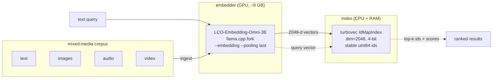

# omni-retrieval

**Fully-local, air-gapped cross-modal retrieval across text, images, audio, and video.** One model embeds everything into a single shared vector space (video is handled via its frames and audio track), and a compact 4-bit index runs fast nearest-neighbor search on CPU. Type a plain-language description and get back the matching document, photo, audio clip, or video. It matches on content rather than metadata, so your files need no captions or tags, and it all runs on your own hardware.

It pairs:

- **[LCO-Embedding-Omni-3B-2605](https://huggingface.co/LCO-Embedding/LCO-Embedding-Omni-3B-2605)** - a contrastively fine-tuned Qwen2.5-Omni-Thinker that emits **2048-dim** embeddings for text / image / audio / video into one shared space, served locally via `llama.cpp`.
- **[turbovec](https://github.com/RyanCodrai/turbovec)** - a CPU-resident `IdMapIndex` using 4-bit TurboQuant (~512 bytes/vector, ~5 GB per 10M items), with stable uint64 ids and O(1) deletes.

The result is a `lcovec` CLI: `ingest` a folder, `query` it in natural language.

```text
$ lcovec.py query "a kitten"

query: 'a kitten'

  score=+1.83 (z=+1.16 cos=+0.224)  [text ] A fluffy domestic cat grooming itself by the window.
  score=+1.46 (z=+1.12 cos=+0.111)  [image] cat.jpg
  score=+1.38 (z=+1.06 cos=+0.108)  [image] dog.jpg
  score=+0.97 (z=+0.49 cos=+0.161)  [text ] A loyal dog playing fetch at the park.
```

A text query retrieving an *image* by its visual content, with no metadata on the file, is the point.

---

## Contents

- [How it works](#how-it-works)
- [Two gotchas (read this first)](#two-gotchas-read-this-first)
- [Requirements](#requirements)
- [Install](#install)
- [Quick start](#quick-start)
- [CLI reference](#cli-reference)
- [The modality gap and how it is fixed](#the-modality-gap-and-how-it-is-fixed)
- [What actually works (measured)](#what-actually-works-measured)
- [Performance and footprint](#performance-and-footprint)
- [Configuration](#configuration)
- [Project layout](#project-layout)
- [Limitations](#limitations)
- [Credits](#credits)
- [License](#license)

---

## How it works



The pipeline has four stages.

**1. Embedding into one shared space.** A single model, LCO-Embedding-Omni-3B, turns any input (a sentence, a photo, an audio clip) into one 2048-dimensional vector. It was contrastively trained to place semantically related inputs near each other *regardless of modality*, so the sentence "a sleeping cat" and a photograph of a sleeping cat land close together in the same space. That shared geometry is what makes typing words and getting back a matching image possible. The model is served by a `llama.cpp` fork with `--pooling last` (the embedding is the final token's hidden state) and the vectors come out L2-normalized, so similarity is a plain dot product (cosine).

**2. Ingestion, routed by file type.** `ingest` walks the paths you give it and handles each file according to its extension:

- **text** (`.txt`, `.md`, ...): the file's contents are read and embedded directly.
- **images** and **audio** (`.jpg`, `.wav`, ...): the raw file is base64-encoded and embedded as media.
- **video** (`.mp4`, ...): the embedder rejects container files, so `lcovec` uses `ffmpeg` to split each clip into a representative **frame** (embedded and indexed as an image) and its **audio track** (embedded and indexed as audio). Both rows point back to the source video, and the audio row is subject to the speech caveat below.

Re-running `ingest` skips files already in the index.

**3. Indexing.** Each vector is stored in a turbovec `IdMapIndex` under a stable uint64 id, while the file's path and modality are kept in a small JSON sidecar. turbovec quantizes every vector to 4 bits per dimension (TurboQuant), which is what lets ~10M items fit in roughly 5 GB of RAM and keeps nearest-neighbor search fast on CPU, with no GPU needed once the corpus is embedded. Ids survive deletion, so a corpus that constantly gains and loses files stays consistent without rebuilds.

**4. Querying, with cross-modal calibration.** Your text query is embedded by the same model, then searched against the index. A naive nearest-neighbor lookup is biased: text-to-text similarities run systematically higher than text-to-image or text-to-audio, so correct images and audio sink beneath unrelated text. `lcovec` corrects this by searching each modality separately (via turbovec's `allowlist`), standardizing scores within each modality, and ranking by a blend of that standardized score and the raw cosine, so the right photo or clip surfaces next to the right document in a single list. The mechanism is detailed in [The modality gap and how it is fixed](#the-modality-gap-and-how-it-is-fixed).

---

## Two gotchas (read this first)

These two settings are the difference between working embeddings and silent garbage. Both are handled for you by `embedder.sh`, but if you roll your own launch command you **will** hit them. Symptom of either: every image/audio item returns a near-identical vector (cosine ~1.0 between unrelated files).

1. **The fork randomizes the media placeholder.** For prompt-injection hardening, the server's media marker is `<__media_<random>__>` per process unless you pin it. If you send the literal `<__media__>` without pinning, it is tokenized as plain text, the media is dropped, and every item collapses to the same vector. **Fix:** launch with `LLAMA_MEDIA_MARKER='<__media__>'`.

2. **The CLIP graph uses CUDA ops the backend rejects.** Warmup prints `the CLIP graph uses unsupported operators by the backend` and the vision/audio projector produces degenerate output. **Fix:** run the projector on CPU with `--no-mmproj-offload`.

And the request shape: media goes **inside** `content`, not at the top level as the model card implies:

```json
{"content": {"prompt_string": "<__media__>", "multimodal_data": ["<base64>"]}}
```

Plain text stays simple: `{"content": "your text"}`. The endpoint is `POST /embedding`.

---

## Requirements

- A **CUDA GPU with ~9 GB free VRAM** (built/tested on an RTX 4060 Ti 16 GB). The projector runs on CPU, so CPU-only inference is possible but slow.
- `git`, `cmake`, a CUDA toolkit (to build the fork).
- `python3` with `pip`.
- `ffmpeg` (only for audio/video ingestion).
- ~6 GB disk for the model weights.

This loads the multimodal **embedding** path of Qwen2.5-Omni, which mainline `llama.cpp` and Ollama do not ship. You must build the **[ht-llama.cpp](https://github.com/heiervang-technologies/ht-llama.cpp)** fork.

---

## Install

```bash
git clone https://github.com/giannisanni/omni-retrieval
cd omni-retrieval
pip install -r requirements.txt        # turbovec, numpy, requests

# 1. build the llama.cpp fork (set CMAKE_CUDA_ARCHITECTURES for your GPU:
#    89 = Ada/RTX 40xx, 86 = Ampere, 75 = Turing)
CMAKE_CUDA_ARCHITECTURES=89 ./scripts/build_llama_fork.sh

# 2. download the LCO-Omni GGUF weights + mmproj (~6 GB)
./scripts/download_model.sh
```

By default the fork lands in `~/ht-llama.cpp` and the model in `~/models/lco-omni`. Override with the script arguments or the env vars listed in [Configuration](#configuration).

---

## Quick start

```bash
# start the embedder (load-on-demand; needs ~9 GB VRAM)
./embedder.sh start

# index a folder of mixed media (text, images, audio, video)
./lcovec.py ingest ~/some/folder

# search it in natural language
./lcovec.py query "a red bicycle leaning against a wall" -k 8
./lcovec.py stats

# stop it again to free the GPU
./embedder.sh stop
```

Want the canned demo from the top of this README?

```bash
./scripts/fetch_sample_images.sh     # 4 CC images into ./images/
./embedder.sh start
./poc.py                             # runs the cross-modal proof end to end
```

---

## CLI reference

| command | description |
|---|---|
| `lcovec.py ingest <path>...` | Walk files/dirs, embed by type, add to the index. Re-ingesting skips known sources. |
| `lcovec.py query "<text>" [-k N]` | Cross-modal search. `-k` is the number of results (default 6). |
| `lcovec.py stats` | Item counts per modality. |
| `lcovec.py reset` | Wipe the index and metadata. |
| `embedder.sh start \| stop \| status` | Manage the embedding server. |

Recognized extensions: text (`.txt .md .markdown .rst`), image (`.jpg .jpeg .png .gif .bmp .webp`), audio (`.mp3 .wav .m4a .aac .flac .ogg`), video (`.mp4 .mov .mkv .webm .avi`).

---

## The modality gap and how it is fixed

Embeddings cluster by modality: text-to-text cosines run systematically higher than text-to-image or text-to-audio, even when the cross-modal match is correct. In a naive single ranked list this buries correct images and audio beneath unrelated text.

`lcovec` corrects the calibration at query time:

1. Search **each modality separately** using turbovec's `allowlist` (one `IdMapIndex`, one allowlisted query per modality), so each modality gets representative score statistics.
2. **Standardize** within each modality: `z = (cos - mean) / std`.
3. **Rank by a blend** that keeps absolute relevance so an irrelevant modality's relative-best cannot float to the top:

   ```text
   score = z + 3 * cos
   ```

On a controlled probe set this moved the correct image from rank ~7 to rank ~2 in a mixed list, while keeping the matching text at rank 1.

---

## What actually works (measured)

Small controlled probes on the reference hardware. These are descriptive, not a benchmark.

**Text -> image** (image-only corpus, 4 distinct images): **4/4** queries rank the correct image first. The image space is semantically structured (cat/dog pairwise cosine 0.52, the highest pair; unrelated pairs 0.32-0.41).

**Text -> audio depends on whether the audio contains speech.**

| clip type | best text->audio cosine | retrievable by text? |
|---|---|---|
| speech (spoken monologue) | 0.097, all content-matching queries beat all distractors (mean 0.084 vs 0.032) | **yes** |
| sound-effects only (no speech) | 0.038, no separation from distractors | no |

The model is language-centric: it aligns audio to words well when the audio carries **speech**, and poorly for pure sound effects or music. Retrieve non-speech audio by **audio-to-audio** similarity instead of text. Absolute audio cosines stay low (~0.07-0.10 even for matches), which is exactly why the per-modality standardization above matters.

**Video:** raw `.mp4` is rejected by the embedder; `lcovec` decomposes it into a frame (image) + audio track (subject to the speech rule above).

| capability | status |
|---|---|
| text -> text | strong |
| text -> image | strong |
| text -> audio (speech) | works (rank-correct, low absolute scores) |
| text -> audio (non-speech) | unreliable; use audio-to-audio |
| text -> video | via extracted frame + audio |
| add / search / delete with stable ids | works (O(1) delete) |

---

## Performance and footprint

- **VRAM:** ~9 GB resident (Q8 weights 3.4 GB + F16 mmproj 2.5 GB + KV cache + CUDA context). Fits a 16 GB card with room to spare.
- **Index:** ~512 bytes per vector at 4-bit (~5 GB for 10M items), held in CPU RAM. 2-bit halves it.
- **Throughput:** text embeds are fast; media embeds run the projector on CPU (~30 s per ~15 s audio clip on an 8-core box). Fine for batch ingestion, not for high-QPS media ingest.
- **Context:** 4096 tokens. Audio is ~100 tokens/second, so clips beyond ~40 s should be chunked.

---

## When do I need to re-embed?

You embed each item **once** and reuse the index indefinitely. The index is persisted to `~/.lcovec/store`, so it survives restarts, and search runs on CPU with the embedder unloaded.

- **Adding files:** no re-embed of existing data. `ingest` only embeds files not already in the index.
- **Querying, restarting, moving the store:** no re-embed. Just point `LCOVEC_STORE` at it.
- **Changing the embedding model:** **full re-embed required.** Embeddings are model-specific. A vector from one model and a vector from another live in different geometric spaces and are not comparable, even at the same dimensionality, so you cannot search across them or mix them in one index. Switching models (or even a different quantization that changes the model's output) means rebuilding the index from scratch.

In other words: the index is decoupled from the embedder and will store whatever vectors you give it, but the vectors themselves are tied to the model that produced them. This tool is built specifically around LCO-Embedding-Omni (the dimension and multimodal request format are fixed to it); pointing it at a different model takes code changes and a fresh index.

---

## Configuration

| variable | default | used by |
|---|---|---|
| `LCO_SERVER` | `http://127.0.0.1:8090` | `lcovec.py`, `poc.py` |
| `LCOVEC_STORE` | `~/.lcovec/store` | `lcovec.py` |
| `LLAMA_SERVER_BIN` | `~/ht-llama.cpp/build/bin/llama-server` | `embedder.sh` |
| `LCO_MODEL` | `~/models/lco-omni/LCO-Embedding-Omni-3B-2605-Q8_0.gguf` | `embedder.sh` |
| `LCO_MMPROJ` | `~/models/lco-omni/mmproj-LCO-Embedding-Omni-3B-2605-F16.gguf` | `embedder.sh` |
| `LCO_PORT` | `8090` | `embedder.sh` |

---

## Project layout

```text
omni-retrieval/
  lcovec.py            # the CLI: ingest / query / stats / reset
  embedder.sh          # start/stop the embedding server (pins the two gotchas)
  poc.py               # end-to-end cross-modal proof on sample data
  requirements.txt
  scripts/
    build_llama_fork.sh    # clone + CUDA-build the ht-llama.cpp fork
    download_model.sh      # fetch the LCO-Omni GGUF + mmproj
    fetch_sample_images.sh # 4 CC images for poc.py
```

Index and metadata persist under `~/.lcovec/store` (`index.tvim`, `meta.json`, `derived/`).

---

## Limitations

This is an engineering proof-of-concept, validated but not a benchmark study. The probe corpora are small, so reported numbers are descriptive with no confidence intervals. Cross-modal accuracy was measured on a semantically disjoint set and will overstate performance on fine-grained or near-duplicate corpora. Absolute cosine magnitudes are not comparable across modalities by construction (the modality gap), so ranking, not raw score, is the operative quantity. There is no folder-watcher, web UI, or auth; it is a CLI over a local index.

---

## Contributing

Issues and PRs welcome. Please run `ruff check .` and `shellcheck embedder.sh scripts/*.sh` first (CI runs both). See [CONTRIBUTING.md](CONTRIBUTING.md).

## Credits

- **LCO-Embedding-Omni** - [model](https://huggingface.co/LCO-Embedding/LCO-Embedding-Omni-3B-2605), [GGUF build](https://huggingface.co/marksverdhei/LCO-Embedding-Omni-3B-2605-GGUF), paper [arXiv:2510.11693](https://arxiv.org/abs/2510.11693). Built on [Qwen2.5-Omni](https://huggingface.co/Qwen/Qwen2.5-Omni-3B).
- **turbovec** - [repo](https://github.com/RyanCodrai/turbovec), TurboQuant paper [arXiv:2504.19874](https://arxiv.org/abs/2504.19874).
- **ht-llama.cpp** - [fork](https://github.com/heiervang-technologies/ht-llama.cpp) adding the Qwen2.5-Omni embedding arch, on top of [llama.cpp](https://github.com/ggml-org/llama.cpp).

This repo's own code is Apache-2.0; the model and dependencies carry their own licenses.

## License

[Apache License 2.0](LICENSE).
